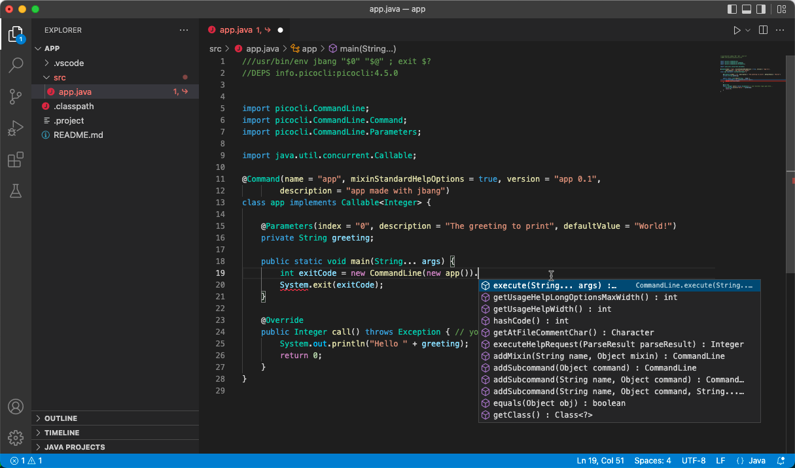

== Editing

=== The JBang Way

image::images/mandaloriandessert.jpg[background, size=cover]

=== The Simplest Way

[source,bash,highlight="1|10..14"]
----
jbang edit app.java
[jbang] You requested to open default editor but no default 
editor configured.

jbang can download and configure a visual studio code (VSCodium) 
with Java support to use

Do you want to

(1) Download and run VSCodium
(2) Use 'code'
(3) Use 'eclipse'
(4) Use 'idea'
(0) Cancel
----

[%notitle]
=== ...

[background-iframe="https://www.jbang.dev/documentation/guide/latest/editing.html#ide-and-editor-support"]
=== Anywhere

[.columns]
=== Direct IDE Support

[.column.is-two-thirds]
IntelliJ
image:images/intellij.png[width="150%"]

[.column]
Eclipse and Visual Studio Code In progress

